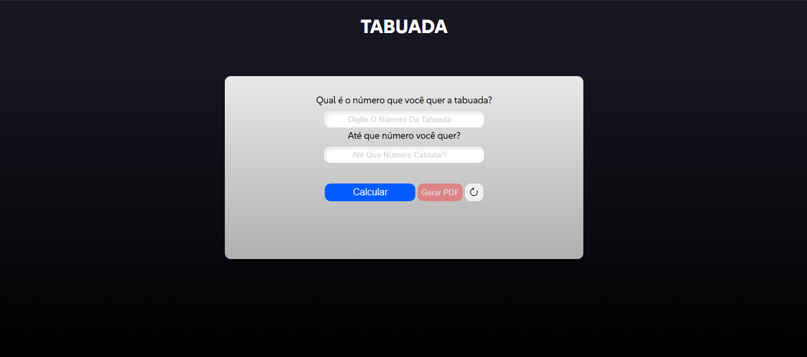

# 🧮 Multi-Table

> A simple and interactive web application that generates multiplication tables based on user input and allows exporting them as PDFs.

---

## 👁️ Preview


Live Demo: https://samuel-fsilva.github.io/tabuada/

---

## 🚀 About

> This web app allows users to enter a number and generate its multiplication table. Additionally, it offers the functionality to export the multiplication table as a PDF, making it convenient for offline usage, printing, or saving.
> The interface is clean and intuitive, with real‑time results, clear visual feedback, and the ability to generate a PDF for easy sharing or offline reference.

> [📝 here a generated PDF example 📝](./documents/tabuada_exemplo.pdf)

---

## 🧩 How to use

1. Visit the Website:
   - Open the link to the project in your web browser [HERE](https://samuel‑fsilva.github.io/tabuada/):
2. Enter a Number:
   - In the input field, type the number for which you want to generate the multiplication table (e.g., 5, 8, 12). The table will be generated when you click the "Calcular" button.
3. View the Multiplication Table:
   - The app will display the multiplication table for that number. For example, for 5, it will show:
   ```
   5 x 1 = 5
   5 x 2 = 10
   5 x 3 = 15
   ...
   ```
4. Export the Table as PDF:
   - After the multiplication table is generated, you can download it as a PDF by clicking the "Gerar PDF" button.
5. Reset and Generate a New Table:
   - To generate a new multiplication table, simply type a different number in the input field and then click the "Calcular" again. To clean all inputs and remove the multiplication table (if exists), just press button with the refresh "🔄" icon. 

---

## 🛠️ Technologies

- HTML
- CSS
- JavaScript (Vanilla)
- html2pdf Library

---

## 📦 Installation

```
# Clone the repository
https://github.com/samuel-fsilva/tabuada.git

# Enter the folder
cd tabuada
```

---

## 📁 Project Structure

```
tabuada/
│── css/
│   └── style.css
│── documents/
│   └── tabuada_exemplo.pdf
│── images/
│   └── screenshot/
│── js/
│   └── app.js
│── index.html
│── README.md
```

---

## 🗺️ Roadmap

- [ ] Improve inputs labels
- [ ] Better PDF formatting

---

## 🙋‍♂️ Author

GitHub: https://github.com/samuel-fsilva
